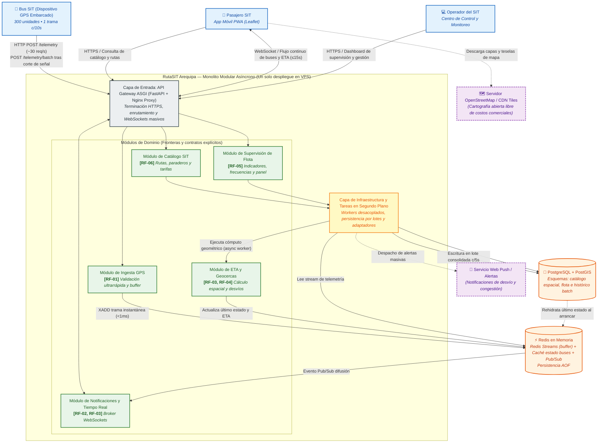

# RutaSIT Arequipa — Laboratorio 04: Fundamentos de arquitectura de software
Construcción de Software · EPIS-UNSA · 2026-B · Grupo 06

## Integrantes
| Nombre | Rol en el laboratorio |
|--------|-----------------------|
| Arce Valencia Anderson Lino | Arquitecto líder y diagramador: drivers (E1), diagrama Mermaid (E3), alternativa en PlantUML (E5) y vista de despliegue (E6) |
| Carlos Ccamaqque Wilson Freddy | Evaluador de trade-offs, redactor de ADR y verificador de IA: matriz de decisión (E2), ADR (E4), bitácora de IA (E7) y README (E8) |

## Caso
**Caso 6 — RutaSIT Arequipa.** Sistema de seguimiento en tiempo real de los buses del Sistema Integrado de Transporte de Arequipa. Los 300 buses envían su posición GPS cada 10 segundos; el pasajero ve en un mapa dónde está su bus y cuánto falta para que llegue a su paradero, y el centro de control recibe alertas cuando un bus se desvía de su ruta o hay congestión. El MVP debe salir en 1 mes, con 2 desarrolladores y un único VPS de bajo costo.

**Atributo de calidad crítico: rendimiento en tiempo real.** Con unas 30 tramas por segundo y 1500 pasajeros conectados en hora punta, el cambio de posición debe llegar a la pantalla en 15 s o menos (p95). Ver [QA-01 en drivers.md](docs/architecture/drivers.md).

## Arquitectura elegida
Monolito modular asíncrono (FastAPI + Redis + PostgreSQL/PostGIS), elegido con 4.45/5 en la [matriz de decisión](docs/architecture/matriz-decision.md).

## Decisiones arquitectónicas
- [ADR-001: Estilo arquitectónico — monolito modular asíncrono con búfer en Redis](docs/architecture/adr/001-estilo-arquitectonico.md)
- [ADR-002: Base de datos geovial — PostgreSQL + PostGIS y Redis para el estado en vivo](docs/architecture/adr/002-base-de-datos-geovial.md)
- [ADR-003: Transmisión en tiempo real — WebSocket con Redis Pub/Sub](docs/architecture/adr/003-transmision-tiempo-real.md)

## Entregables
| Código | Archivo |
|:---:|---|
| E1 | [docs/architecture/drivers.md](docs/architecture/drivers.md) |
| E2 | [docs/architecture/matriz-decision.md](docs/architecture/matriz-decision.md), [demostración del abogado del diablo](docs/architecture/demostracion-abogado-del-diablo.md) y gráfico [diagramas/matriz.py](docs/architecture/diagramas/matriz.py) → [imagen](docs/architecture/diagramas/img/matriz-decision.png) |
| E3 | [diagramas/arquitectura.mmd](docs/architecture/diagramas/arquitectura.mmd) → [imagen](docs/architecture/diagramas/img/arquitectura.png) |
| E4 | [docs/architecture/adr/](docs/architecture/adr/) |
| E5 | [diagramas/alternativa.puml](docs/architecture/diagramas/alternativa.puml) → [imagen](docs/architecture/diagramas/img/alternativa.png) |
| E6 | [diagramas/despliegue.py](docs/architecture/diagramas/despliegue.py) → [imagen](docs/architecture/diagramas/img/despliegue.png) |
| E7 | [docs/architecture/bitacora-ia.md](docs/architecture/bitacora-ia.md) |
| E8 | Este README |
| Cuestionario | [docs/cuestionario.md](docs/cuestionario.md) |
| Reto opcional | [.github/workflows/diagramas.yml](.github/workflows/diagramas.yml): regenera los PNG y SVG de los `.mmd` con mermaid-cli en cada push a `main` |

**Sobre la vista de despliegue:** `despliegue.py` se ejecutó con la librería Diagrams y Graphviz (`python docs/architecture/diagramas/despliegue.py` desde la raíz). El archivo `despliegue.puml` es una vista complementaria del mismo despliegue hecha en PlantUML ([imagen](docs/architecture/diagramas/img/despliegue-plantuml.png)); no reemplaza al script.

**Reto opcional:** la GitHub Action [`diagramas.yml`](.github/workflows/diagramas.yml) se ejecuta en cada push a `main` que modifique un archivo `.mmd` (o a mano desde la pestaña *Actions*). Instala mermaid-cli, vuelve a renderizar `arquitectura.mmd` en `diagramas/img/` y, si la imagen cambió, la sube con un commit de `github-actions[bot]`.

## Reflexión sobre el uso de la IA
La IA nos ahorró mucho tiempo en lo mecánico: armar la estructura de los drivers, escribir la sintaxis de Mermaid, PlantUML y Diagrams, y proponer alternativas que no habíamos pensado, como la variante de Django con un ingestor aparte. Donde más nos sirvió fue como abogado del diablo, porque nos obligó a ver que nuestra opción favorita podía bloquear el event loop o perder el estado si Redis se caía.
También cometió errores, y no siempre se notaban. Primero sugirió microservicios con brokers pesados para un equipo de 2 personas, y en la crítica a la Alternativa A dio cifras alarmantes ("agota los workers", "100 % de I/O") que no resistieron un cálculo simple con la Ley de Little.
Aprendimos a tratar cada número que da la IA como una hipótesis: pasarlo a carga por segundo, compararlo con las restricciones de `drivers.md` y no copiarlo a un documento sin una fuente o un cálculo. La IA propone, pero las decisiones y su defensa son nuestras.
