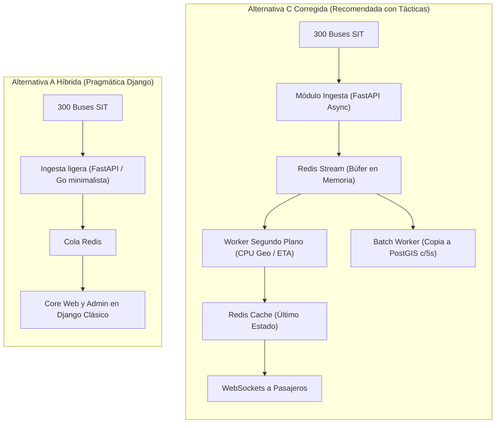

# Demostración: Análisis y Alternativas del Abogado del Diablo — RutaSIT Arequipa

Este documento profundiza en la crítica adversarial aplicada a las propuestas iniciales de arquitectura para **RutaSIT Arequipa**, evaluando los riesgos reales en producción y detallando las alternativas tácticas surgidas tras desafiar los supuestos ideales.

---

## 1. Crítica Destructiva a las Tres Alternativas Iniciales

### A. Ataque a la Alternativa A: Monolito Tradicional en Capas (Django + PostgreSQL)

> *"Dicen que es la más rápida de programar para 2 desarrolladores en 1 mes. Pero eso es una ilusión que va a explotar el primer día de pruebas."*

* **La trampa del WSGI síncrono:** Django tradicional asigna un hilo/proceso del sistema operativo por cada petición entrante. Con 300 buses enviando tramas cada 10 s ($\approx 30$ req/s constantes) sumado a cientos de pasajeros refrescando el mapa, los workers de Gunicorn se encolan rápidamente.
* **El colapso de la base de datos:** Escribir cada posición GPS directo a la tabla con el ORM de Django generará más de 2,500,000 inserciones al día. En un VPS de bajo costo con almacenamiento compartido (I/O limitado), el disco se saturará al 100% de I/O wait en horas punta, elevando el tiempo de respuesta a más de 30 segundos y violando el driver crítico **QA-01**.
* **El veredicto del Abogado:** Es fácil de arrancar, pero **inviable técnicamente** para tiempo real de alta frecuencia sin rediseñar por completo el motor de ingesta.

---

### B. Ataque a la Alternativa B: Microservicios Distribuidos (FastAPI + RabbitMQ + Múltiples BD)

> *"Es la arquitectura de moda que todos quieren poner en su CV, pero en este proyecto con nuestras restricciones es un suicidio técnico."*

* **La falacia de los recursos en 1 solo VPS (R-03):** Levantar RabbitMQ (corre sobre Erlang y consume $\ge 500$ MB de RAM), 4 o 5 servicios de Python (150–250 MB cada uno), más 3 bases de datos independientes va a consumir más de 3.5 GB de RAM sin siquiera haber recibido el primer bus. Al primer pico de pasajeros, el *Out-Of-Memory (OOM) Killer* del kernel de Linux terminará procesos aleatoriamente.
* **La trampa del plazo de 1 mes (R-01):** Solo 2 personas tendrían que definir contratos de API gRPC/REST, orquestar contenedores, configurar tracing distribuido y manejar fallos de red interservicio. No llegarán al MVP en 4 semanas.
* **El veredicto del Abogado:** Arquitectura sobrediseñada (*overengineering*) que viola las restricciones de presupuesto y tiempo de entrega.

---

### C. Ataque a la Alternativa C: Monolito Modular Asíncrono (FastAPI + Redis + PostGIS)

> *"Parece la ganadora perfecta porque promete bajo consumo y alta velocidad, pero tiene costos ocultos graves en producción."*

* **El riesgo mortal del Event Loop:** Python `asyncio` corre en un solo hilo por worker. Si una función hace un cálculo pesado de PostGIS/geometría para verificar desvíos de ruta ($>100$ m) y tarda 200 ms de CPU síncrona, **congela el bucle de eventos y detiene el procesamiento de los otros 299 buses y los WebSockets de todos los pasajeros**.
* **El espejismo del orden modular:** Con 2 desarrolladores apurados por entregar en 1 mes, la separación modular suele ser una mentira de carpetas: empezarán a importar funciones directamente entre módulos bajo presión, convirtiéndolo en un monolito espagueti inmanejable.
* **Punto único de fallo volátil:** Si todo el estado de los buses vive en la memoria de Redis y este proceso cae en el VPS, la pantalla de los paraderos se queda vacía de inmediato.

---

## 2. Alternativas Prácticas que Propone el Abogado del Diablo

Para resolver las vulnerabilidades detectadas sin caer en la trampa de los microservicios, se plantean tres alternativas tácticas:

### Alternativa C Corregida: Monolito Asíncrono con Búfer en Redis y Workers Desacoplados
* **Mecanismo:** La API FastAPI únicamente valida la trama GPS y ejecuta un `XADD` ultrarrápido a un *Redis Stream* ($<1$ ms). Un proceso worker secundario (o hilos aislados con `asyncio.to_thread`) consume el stream, calcula las proyecciones espaciales y actualiza el último estado en caché. Las escrituras a PostgreSQL se realizan por lotes cada 5 segundos (*batch insert*).
* **Fundamentación:** Elimina el bloqueo del CPU en el bucle principal, amortigua ráfagas de tráfico celular y protege el disco del VPS.

### Alternativa A Híbrida: Django Clásico + Ingestor Dedicado Mínimo
* **Mecanismo:** Aprovecha la velocidad de desarrollo del ecosistema Django (ORM, panel de administración, catálogo de rutas, autenticación y reportería), pero extrae la ingesta de telemetría a un único endpoint ASGI ultraligero que deposita los datos en Redis.
* **Fundamentación:** Reduce la curva de aprendizaje si el equipo tiene mayor trayectoria en Django tradicional, aislando el tráfico pesado de telemetría de las vistas del usuario.

### Alternativa B Minimalista: Arquitectura de 2 Contenedores (Ingesta vs Web)
* **Mecanismo:** En lugar de desplegar 5 microservicios con brokers pesados (RabbitMQ/Kafka), se divide el sistema en solo dos piezas desplegables:
  1. *Servicio de Telemetría y Tiempo Real* (ingesta de 300 buses y emisión de WebSockets).
  2. *Servicio de Gestión y Catálogo* (rutas, paraderos, administración y reportería en base de datos).
* **Fundamentación:** Proporciona aislamiento físico para la ingesta crítica sin incurrir en el infierno operacional de los microservicios completos.
