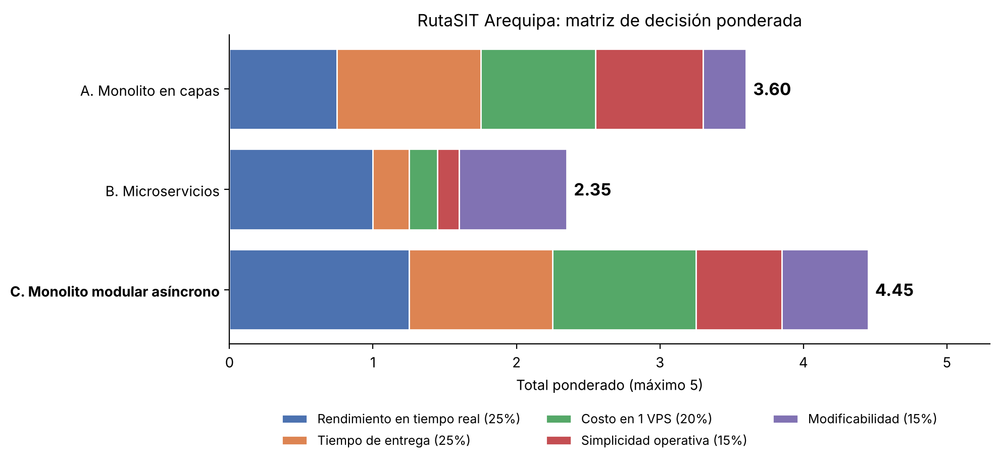

# Matriz de decisión — RutaSIT Arequipa

## Alternativas

- **A. Monolito Tradicional en Capas (Django + PostgreSQL):** Organización en capas secuenciales estándar (Presentación, Lógica de Dominio y Acceso a Datos con ORM). Todas las peticiones HTTP de telemetría GPS (30 req/s), cálculo de tiempos y consultas de usuarios pasan sincrónicamente por el pipeline web tradicional hacia una única base de datos relacional.
- **B. Microservicios Distribuidos (FastAPI/Go + RabbitMQ + Múltiples BD):** Descomposición del sistema en 4 servicios independientes (Ingesta GPS, Estimación de ETA y Geocercas, Catálogo SIT y Notificaciones WebSocket). Cada servicio posee su propia persistencia y se comunican a través de un broker de mensajería asíncrono (RabbitMQ).
- **C. Monolito Modular Asíncrono con Eventos en Memoria (FastAPI + Redis + PostgreSQL/PostGIS):** Un único artefacto desplegable estructurado internamente en módulos desacoplados con límites de dominio explícitos. Utiliza un runtime ASGI asíncrono con FastAPI y Redis en memoria para ingesta de alta frecuencia y difusión WebSocket, respaldado por PostgreSQL con extensión PostGIS para consultas espaciales y persistencia transaccional.

---

## Criterios y pesos (deben sumar 100 %)

| Criterio | Peso | Justificación (driver relacionado) |
| :--- | :---: | :--- |
| **Rendimiento en tiempo real** | 25 % | **QA-01:** Atributo crítico. Ingesta continua de 300 buses cada 10 s ($\approx 30$ req/s) y recálculo dinámico de ETA propagado a usuarios en $\le 15$ s sin cuellos de botella por contención de hilos. |
| **Tiempo de entrega (MVP en 1 mes)** | 25 % | **R-01:** Plazo estricto de 4 semanas. Penaliza arquitecturas con alta sobrecarga de configuración inicial, contratos interservicio complejos o múltiples tuberías de CI/CD. |
| **Costo operativo y viabilidad en 1 VPS** | 20 % | **R-03:** Presupuesto sumamente bajo. Toda la solución en producción debe caber de forma estable en un único servidor modesto (2-4 vCPU, 4-8 GB RAM, $\le 12$ USD/mes) sin requerir orquestadores pesados. |
| **Simplicidad operativa y experiencia del equipo** | 15 % | **R-02:** Equipo de solo 2 desarrolladores con base en Python y SQL. Se requiere facilidad de depuración local, despliegues simples y ausencia de sobrecarga DevOps distribuida. |
| **Modificabilidad y extensibilidad** | 15 % | **QA-03:** Capacidad de incorporar nuevas rutas del SIT, modificar algoritmos de estimación de llegada y alertas de desvío sin acoplamiento cruzado de código ni paradas de servicio. |

---

## Matriz (puntaje 1 = muy malo … 5 = excelente)

| Criterio (peso) | A (Monolito en capas) | B (Microservicios) | C (Monolito modular asíncrono) |
| :--- | :---: | :---: | :---: |
| **Rendimiento en tiempo real (25 %)** | 3 | 4 | **5** |
| **Tiempo de entrega (25 %)** | 4 | 1 | **4** |
| **Costo y viabilidad en 1 VPS (20 %)** | 4 | 1 | **5** |
| **Simplicidad operativa (15 %)** | 5 | 1 | **4** |
| **Modificabilidad (15 %)** | 2 | 5 | **4** |
| **Total ponderado** | **3.60** | **2.35** | **4.45** |

### Cálculo detallado del puntaje ponderado:
$$\text{Total Ponderado} = \sum (\text{peso} \times \text{puntaje})$$

* **Alternativa A (Capas):** $(0.25 \times 3) + (0.25 \times 4) + (0.20 \times 4) + (0.15 \times 5) + (0.15 \times 2) = 0.75 + 1.00 + 0.80 + 0.75 + 0.30 = \mathbf{3.60}$
* **Alternativa B (Microservicios):** $(0.25 \times 4) + (0.25 \times 1) + (0.20 \times 1) + (0.15 \times 1) + (0.15 \times 5) = 1.00 + 0.25 + 0.20 + 0.15 + 0.75 = \mathbf{2.35}$
* **Alternativa C (Monolito Modular Asíncrono):** $(0.25 \times 5) + (0.25 \times 4) + (0.20 \times 5) + (0.15 \times 4) + (0.15 \times 4) = 1.25 + 1.00 + 1.00 + 0.60 + 0.60 = \mathbf{4.45}$

El gráfico se genera con [`diagramas/matriz.py`](diagramas/matriz.py) (matplotlib) a partir de los mismos pesos y puntajes, así que se puede regenerar si cambian. Cada tramo de la barra es el aporte de un criterio (peso × puntaje):

> **Nota de corrección (04/10/2026):** en la primera versión de esta matriz la Alternativa A tenía 2 en rendimiento (total 3.35). Ese puntaje se basaba en una afirmación exagerada de la IA, explicada en la sección siguiente. Tras verificarla, se subió a 3 (total 3.60). La elección no cambia: C sigue arriba por 0.85 puntos.

---

## Afirmaciones de la IA verificadas

| # | Afirmación de la IA | Cómo la verificamos | Resultado |
| :---: | :--- | :--- | :---: |
| 1 | "El modelo WSGI síncrono agota los workers de Python ante 30 req/s continuas" (Alternativa A). | **Cálculo con la Ley de Little** ($L = \lambda \times W$): con $\lambda = 30$ req/s y un tiempo de atención de unos 50 ms por trama (validar y guardar), hay en promedio $30 \times 0.05 = 1.5$ peticiones en curso. Gunicorn recomienda $2 \times \text{núcleos} + 1$ workers, es decir 5 a 9 en un VPS de 2-4 vCPU. La ingesta sola no los agota. | **Exagerada** |
| 2 | "Más de 2,5 millones de inserciones al día saturan el disco del VPS al 100 % de I/O" (Alternativa A). | La cifra diaria es correcta ($300 \times 6 \times 60 \times 24 = 2\,592\,000$), pero como tasa son **30 inserciones por segundo**, una carga baja para PostgreSQL. Lo que sí genera carga es una transacción por trama a través del ORM; insertar por lotes lo resuelve en cualquier estilo. | **Exagerada** |
| 3 | "Monolito modular + Redis + PostgreSQL consume menos de 1.5 GB de RAM en producción" (Alternativa C). | No hay medición que la respalde y la vista de despliegue agrega además Prometheus y Grafana. Se retiró de la conclusión; el consumo real se medirá con `docker stats` durante el piloto. | **Sin evidencia, retirada** |

**Qué cambia:** la debilidad real de A no es la ingesta sino el **empuje hacia los pasajeros**. Sin WebSockets nativos, el mapa dependería de polling: 1500 pasajeros (QA-01) consultando cada 5 s son unas **300 req/s**, diez veces la ingesta, sobre workers síncronos. Agregar Django Channels lo resuelve, pero quita la simplicidad que justificaba elegir A. Por eso A recibe 3 en rendimiento y no 2 ni 5.

---

## Conclusión

Elegimos el **Monolito Modular Asíncrono con Eventos en Memoria (Alternativa C)** con un puntaje sobresaliente de **4.45/5.00**.

### Justificación de la elección:
1. **Cumplimiento del rendimiento crítico (QA-01):** El modelo asíncrono (ASGI con FastAPI) atiende las 30 tramas/s y mantiene abiertas las conexiones WebSocket de los 1500 pasajeros en una sola instancia. Gracias a Redis Pub/Sub, cada cambio se empuja al cliente en lugar de esperar a que pregunte.
2. **Factibilidad en 1 mes y 2 desarrolladores (R-01, R-02):** Evita la dispersión de esfuerzos en múltiples repositorios, gestión de redes virtuales y sincronización distribuida de datos que exige la opción de microservicios.
3. **Optimización de recursos en 1 solo VPS (R-03):** Un solo artefacto más Redis y PostgreSQL/PostGIS, sin broker ni bases duplicadas, cabe en el VPS de 4-8 GB. El consumo real se medirá en el piloto.

La IA también recomendó la Alternativa C, así que la decisión coincide con su propuesta. Lo que el equipo corrigió fue el diseño interno de C (worker separado, búfer en Redis Streams y escrituras por lotes, tras la crítica del abogado del diablo) y los argumentos exagerados contra A.

Para mayores detalles sobre la decisión arquitectónica formal, sus implicancias técnicas y tácticas de mitigación, ver [ADR-001](adr/001-estilo-arquitectonico.md). Asimismo, para consultar el análisis adversarial y las alternativas tácticas surgidas de la crítica profunda, ver [Demostración como Abogado del Diablo](demostracion-abogado-del-diablo.md).
